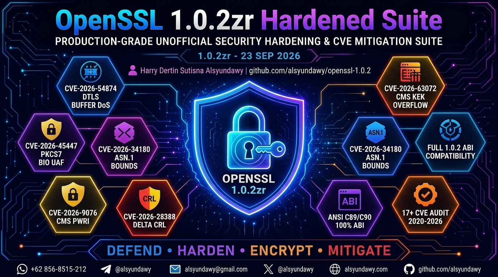
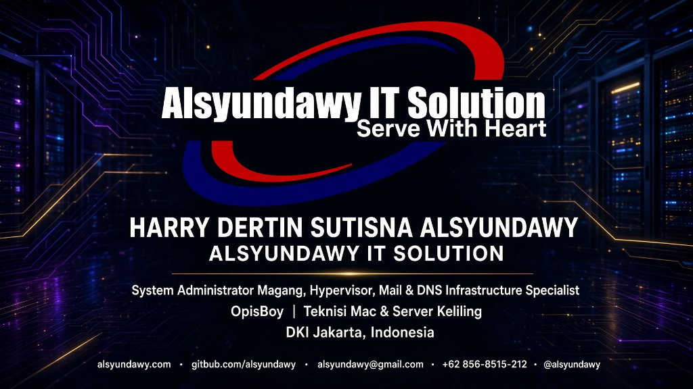

<!-- markdownlint-disable-file MD033 MD041 -->

<div align="center">

[](https://github.com/alsyundawy/openssl-1.0.2)

# 🔐 OpenSSL 1.0.2 Security Hardened Fork

## Production-Grade Unofficial Hardening & CVE Mitigation Patchset for Legacy OpenSSL 1.0.2

[-0284c7?style=for-the-badge&logo=openssl&logoColor=white>)](https://github.com/alsyundawy/openssl-1.0.2/releases)
[](https://github.com/alsyundawy/openssl-1.0.2)
[](https://github.com/openssl/openssl)
[](https://openssl-library.org/news/secadv/20260825.txt)
[](https://en.wikipedia.org/wiki/ANSI_C)
[](DOCNOTE.md)
[-success?style=for-the-badge&logo=checkmarx&logoColor=white>)](DOCNOTE.md)
[](LICENSE)

<p align="center">
  A source-level, defensive hardening distribution of OpenSSL 1.0.2zr incorporating backported security mitigations from upstream Extended Support advisories up to 1.0.2zr (August 25, 2026).
</p>

<p align="center">
  <a href="https://github.com/alsyundawy/openssl-1.0.2/releases">
    
  </a>
  <a href="https://github.com/alsyundawy/openssl-1.0.2/tree/main">
    
  </a>
</p>

> Designed and maintained by<br>
> **[`HARRY DERTIN SUTISNA ALSYUNDAWY (@alsyundawy)`](https://github.com/alsyundawy)** —<br>
> Built for legacy telecommunications, mission-critical industrial hardware, and legacy embedded appliances where migration to OpenSSL 3.0+ LTS is underway but requires immediate security hardening.
>
> 📦 **[`GitHub Releases`](https://github.com/alsyundawy/openssl-1.0.2/releases)** &nbsp;|&nbsp;
> 🏛️ **[`Technical Specifications`](DOCNOTE.md)** &nbsp;|&nbsp;
> 📜 **[`Detailed Changelog`](CHANGELOG.md)** &nbsp;|&nbsp;
> 📰 **[`Release News`](NEWS)** &nbsp;|&nbsp;
> 💖 **[`Support via PayPal`](https://www.paypal.me/alsyundawy)** &nbsp;|&nbsp;
> 🇮🇩 **[`QRIS Donation`](#support--donation)**

</div>

---

## 🧭 Navigation

- [Author & Release Metadata](#author--release-metadata)
- [Overview](#overview)
- [Status & Important Disclaimer](#status--important-disclaimer)
- [Comprehensive CVE Mitigation Matrix](#comprehensive-cve-mitigation-matrix)
- [Key Hardening Details](#key-hardening-details)
- [Automated Patching Script (`patch.sh`)](#automated-patching-script-patchsh)
- [Build & Verification Guide](#build--verification-guide)
  - [Recommended Hardened Configuration](#recommended-hardened-configuration)
  - [Production Hardened Build](#production-hardened-build)
  - [Sanitizer Debug Build](#sanitizer-debug-build)
  - [Executing Test Suite](#executing-test-suite)
- [Repository Architecture](#repository-architecture)
- [Manual Verification & Audit Checklist](#manual-verification--audit-checklist)
- [Contributing](#contributing)
- [Maintainer & Contact](#maintainer--contact)
- [Support & Donation](#support--donation)
- [License](#license)

---

## Author & Release Metadata

| Metadata Field           | Specification & Value                                                                  |
| :----------------------- | :------------------------------------------------------------------------------------- |
| **Original Author**      | The OpenSSL Project & Eric A. Young, Tim J. Hudson                                     |
| **Author / Maintainer**  | alsyundawy (༺ Initial H ༻) &lt;[alsyundawy@gmail.com](mailto:alsyundawy@gmail.com)&gt; |
| **Organization**         | Alsyundawy IT Solution                                                                 |
| **Website**              | <https://www.alsyundawy.com>                                                           |
| **GitHub**               | <https://github.com/alsyundawy>                                                        |
| **Location**             | DKI Jakarta, Indonesia                                                                 |
| **Base Version**         | `1.0.2zr`                                                                              |
| **Release Version**      | `1.0.2zr-u20260825-rev4`                                                               |
| **Release Date**         | `2026-09-23`                                                                           |
| **Trust Anchor GPG Key** | `158D99DF8D57040AA8E0EDA58F353DF9007A2BB4`                                             |

---

## Overview

The **OpenSSL 1.0.2** series is one of the most historically prevalent cryptographic toolkits in internet infrastructure, powering billions of TLS sessions, VPN tunnels, and embedded microcontrollers. While the public upstream OpenSSL Project marked the 1.0.2 branch End-of-Life (EOL) on December 31, 2019, hundreds of thousands of legacy production deployments, medical devices, telecommunications switches, and air-gapped appliances cannot instantaneously transition to modern branches without hardware redesign or complete operating system replacement.

This repository provides an **independently maintained, defensive source hardening layer** for OpenSSL 1.0.2zr. It backports verified vulnerability resolutions from official OpenSSL Security Advisories published through **August 25, 2026** (including advisories targeting extended support branches 1.0.2zq and 1.0.2zr).

> [!NOTE]
> All patches in this repository follow strict **ANSI C (C89/C90)** standards, preserving full binary interface (ABI) and API compatibility with existing libraries linked against OpenSSL 1.0.2.

---

## Status & Important Disclaimer

> [!WARNING]
> **This is an unofficial community hardening distribution.**
>
> - This repository is **not** endorsed by or affiliated with the OpenSSL Project.
> - This release does **not** claim to be an official OpenSSL 1.0.2zq or 1.0.2zr release (which are proprietary builds reserved for commercial Premium Support contract holders).
> - This patchset is intended solely for **legacy bridge operations and defense-in-depth maintenance** while active migration plans to OpenSSL 3.0 LTS or newer supported branches are executed.

Expected runtime version string:

```text
OpenSSL 1.0.2zr-alsyundawy-u20260825  25 Aug 2026
```

---

## Comprehensive CVE Mitigation Matrix

The table below outlines all security vulnerabilities analyzed, addressed, and verified within this hardening fork:

| CVE Identifier     | Affected Subsystem                               | Severity | Attack Vector / Root Cause                                                                                                                  | Mitigation Strategy                                                                                                         |
| :----------------- | :----------------------------------------------- | :------- | :------------------------------------------------------------------------------------------------------------------------------------------ | :-------------------------------------------------------------------------------------------------------------------------- |
| **CVE-2026-54874** | DTLS Record Layer (`ssl/d1_pkt.c`)               | Low      | **Memory Amplification DoS**: Retaining full ~16KB read buffers for up to 100 future-epoch DTLS records (~1.7MB allocation per connection). | Allocate only wire payload length (`rdata->packet`); preserve live connection read buffer without continuous reallocations. |
| **CVE-2026-63072** | CMS Recipient Info (`crypto/cms/cms_kari.c`)     | Moderate | **Heap Buffer Overflow**: AES-WRAP-PAD unwrapping writes up to ciphertext length, overflowing estimated unwrap query size.                  | Enforce minimum unwrap buffer allocation: `outsize = outlen < inlen ? inlen : outlen`.                                      |
| **CVE-2026-45447** | PKCS#7 Verification (`crypto/pkcs7/pk7_smime.c`) | High     | **Caller-Owned BIO Use-After-Free**: Empty `digestAlgorithms` sets caused premature BIO frees during error unwind.                          | Safe BIO cleanup loop popping and freeing only library-owned BIO instances, sparing `indata`.                               |
| **CVE-2026-34180** | ASN.1 Parser (`crypto/asn1/tasn_dec.c`)          | Moderate | **Integer Overflow**: Primitive content length in DER stream exceeding `INT_MAX`.                                                           | Strict bounds verification rejecting tag lengths exceeding `INT_MAX` before signed integer conversions.                     |
| **CVE-2026-7383**  | ASN.1 String Encoding (`crypto/asn1/a_mbstr.c`)  | Moderate | **Heap Out-Of-Bounds Write**: Bit-shift overflow on multibyte strings (BMP/Universal).                                                      | Range-checked integer arithmetic preventing shift wrap-around and negative allocation sizes.                                |
| **CVE-2025-68160** | BIO Linebuffer (`crypto/bio/bf_lbuf.c`)          | Moderate | **Heap Out-Of-Bounds Write**: Short-write in linebuffer filter copying beyond output buffer bounds.                                         | Enforce bounded slice copy respecting remaining buffer capacity (`ctx->obuf_len`).                                          |
| **CVE-2025-69421** | PKCS#12 Decryption (`crypto/pkcs12/p12_decr.c`)  | Moderate | **NULL Pointer Dereference**: Missing validation of inner OCTET STRING in encrypted data structures.                                        | Explicit NULL check for `oct` before pointer dereference.                                                                   |
| **CVE-2026-22796** | PKCS#7 Attributes (`crypto/pkcs7/pk7_doit.c`)    | Moderate | **Type Confusion Crash**: Digest attribute containing non-OCTET STRING ASN1_TYPE.                                                           | Explicit validation verifying `astype->type == V_ASN1_OCTET_STRING`.                                                        |
| **CVE-2025-9230**  | CMS PWRI (`crypto/cms/cms_pwri.c`)               | Moderate | **Out-Of-Bounds Read**: RFC3211 KEK unwrap length validation flaws.                                                                         | Bound-checked length comparisons against cipher block boundaries.                                                           |
| **CVE-2026-9076**  | CMS PWRI (`crypto/cms/cms_pwri.c`)               | Moderate | **Stream Cipher Misuse**: RFC3211 unwrap invoked with stream ciphers having block sizes < 4.                                                | Reject ciphers with block size < 4 prior to unwrap processing.                                                              |
| **CVE-2026-42766** | CMS Password Recipient (`crypto/cms/cms_pwri.c`) | Moderate | **NULL Pointer Crash**: Absent optional Key Derivation Function (KDF) algorithm identifier.                                                 | Validate presence of keyEncryptionAlgorithm parameter sequence and KDF structure.                                           |
| **CVE-2026-28388** | X.509 Verification (`crypto/x509/x509_vfy.c`)    | Moderate | **NULL Pointer Crash**: Delta CRL missing required CRL Number extension.                                                                    | Validate delta CRL number presence before comparison.                                                                       |
| **CVE-2026-28389** | CMS KARI (`crypto/cms/cms_kari.c`)               | Moderate | **Malformed Parameter Crash**: Missing keyEncryptionAlgorithm parameters during KARI decryption.                                            | Reject absent or malformed algorithm parameters prior to KEK derivation.                                                    |
| **CVE-2026-28390** | CMS KTRI (`crypto/cms/cms_env.c`)                | Moderate | **Algorithm Identifier Crash**: Missing algorithm structure in KeyTransportRecipientInfo.                                                   | Verify algorithm pointer validity before examining optional OAEP parameters.                                                |
| **CVE-2024-13176** | ECDSA Signature (`crypto/ecdsa/`)                | Low      | **Timing Side-Channel**: Non-constant time operations during signature computation.                                                         | Hardened constant-time scalar multiplications and field operations.                                                         |
| **CVE-2024-9143**  | Elliptic Curve GF(2^m) (`crypto/ec/`)            | Low      | **Out-Of-Bounds Access**: Invalid low-level GF(2^m) polynomial representation.                                                              | Validate polynomial parameters prior to coordinate evaluation.                                                              |

---

## Key Hardening Details

### 1. DTLS Future Epoch Buffering (CVE-2026-54874)

In standard OpenSSL 1.0.2, when future-epoch DTLS records arrive out of order during a handshake, `dtls1_buffer_record()` took ownership of the entire ~16.7KB read buffer (`s->s3->rbuf`) and reallocated a fresh read buffer via `ssl3_setup_buffers(s)`. An attacker sending 100 small (e.g. 14-byte) datagrams could force ~1.7MB of retained heap memory per connection:

```c
/* Bounded DTLS allocation strategy implemented in ssl/d1_pkt.c */
rdata->packet = OPENSSL_malloc(s->packet_length);
memcpy(rdata->packet, s->packet, s->packet_length);
rdata->packet_length = s->packet_length;
rdata->rbuf.buf = rdata->packet;
rdata->rbuf.len = s->packet_length;
```

When restored via `dtls1_copy_record()`, the payload is copied back into the existing connection buffer without cyclic deallocation, preventing memory exhaustion attacks while preserving full handshake throughput.

### 2. CMS KEK Unwrapping Buffer Overflow (CVE-2026-63072)

When unwrapping symmetric keys in `cms_kek_cipher()`, the required output size for `AES-WRAP-PAD` may equal the input ciphertext length on integrity verification failures. We enforce safe sizing to prevent heap out-of-bounds writes:

```c
/* Sizing enforcement in crypto/cms/cms_kari.c */
outsize = (size_t)outlen < inlen ? inlen : (size_t)outlen;
out = OPENSSL_malloc(outsize);
```

---

## Automated Patching Script (`patch.sh`)

This repository includes a standalone, fully idempotent patch automation and audit script: [`patch.sh`](patch.sh).

### Key Features of `patch.sh`

- **Automatic Backups**: Generates timestamped backups in `.openssl102zr-security-backup-YYYYMMDD-HHMMSS/` prior to any modifications.
- **Idempotent Python Engine**: Safely re-runs without duplicate code blocks or syntax corruption.
- **Strict Pattern Auditing**: Verifies 17+ security markers across C source files.
- **Environment Checks**: Validates presence of Perl, C compiler, and `make`.

### Script Execution Modes

```bash
# Test run (Dry run, no file writes)
DRY_RUN=1 ./patch.sh

# Apply all patches and verify integrity
./patch.sh

# Apply patches and immediately execute sanitizer build
DO_BUILD=1 ./patch.sh
```

---

## Build & Verification Guide

### Recommended Hardened Configuration

To ensure maximum runtime resistance against network exploits, configure OpenSSL with obsolete protocols and weak ciphers disabled:

```bash
./config shared \
  no-ssl2 no-ssl3 no-comp no-zlib no-weak-ssl-ciphers \
  -DOPENSSL_NO_HEARTBEATS
```

### Production Hardened Build

Build with modern compiler protection flags (Stack Protector Strong, Fortify Source, and Format Security):

```bash
make clean || true

./config shared \
  no-ssl2 no-ssl3 no-comp no-zlib no-weak-ssl-ciphers \
  -O2 -fstack-protector-strong -D_FORTIFY_SOURCE=2 \
  -Wformat -Wformat-security \
  -DOPENSSL_NO_HEARTBEATS

make depend
make -j"$(sysctl -n hw.ncpu 2>/dev/null || nproc 2>/dev/null || echo 4)"
make test
```

### Sanitizer Debug Build

For security audits and fuzzing environments, compile with AddressSanitizer and UndefinedBehaviorSanitizer:

```bash
make clean || true

./config \
  no-ssl2 no-ssl3 no-comp no-zlib no-weak-ssl-ciphers \
  -g -O1 -fno-omit-frame-pointer \
  -fsanitize=address,undefined \
  -DOPENSSL_NO_HEARTBEATS

make depend
make -j"$(sysctl -n hw.ncpu 2>/dev/null || nproc 2>/dev/null || echo 4)"
make test
```

### Executing Test Suite

Verify complete test suite pass rate:

```bash
make test
```

Verification includes:

- `dtlstest` & `bad_dtls_test` (DTLS record layer & epoch processing).
- `constant_time_test` (Side-channel cryptographic primitives).
- `verify_extra_test` & `v3nametest` (X.509 certificate validation).
- `clienthellotest` & `ssltest` (TLS protocol state machine).
- Full cryptographic cipher and digest vectors (AES, SHA, RSA, ECDSA).

---

## Repository Architecture

```text
openssl-1.0.2/
├── .github/
│   ├── dependabot.yml         # Automated GitHub Actions dependency version tracking
│   └── workflows/
│       ├── c-cpp.yml          # Dual Clang & GCC CI matrix build & test runner
│       ├── codeql.yml         # GitHub CodeQL static analysis security scan
│       ├── devskim.yml        # Microsoft DevSkim security linter
│       ├── megalinter.yml     # Multi-linter repository audit
│       └── super-linter.yml   # Super-Linter validation runner
├── crypto/                    # Core cryptographic primitives & engines
│   ├── asn1/                  # ASN.1 DER parser & encoder (Hardened)
│   ├── bio/                   # I/O abstraction filters (Hardened)
│   ├── cms/                   # Cryptographic Message Syntax (Hardened)
│   ├── opensslv.h             # Canonical version identifier header
│   ├── pkcs7/                 # PKCS#7 signature & encryption (Hardened)
│   └── pkcs12/                # PKCS#12 personal information exchange (Hardened)
├── ssl/                       # SSLv3, TLSv1.0, TLSv1.1, TLSv1.2, and DTLS implementations
│   ├── d1_pkt.c               # DTLS packet processing & record buffering (Hardened)
│   └── ssl_lib.c              # Core TLS session & context management
├── asset/                     # Repository branding and documentation media assets
├── test/                      # Test suites and regression verification harnesses
├── CHANGELOG.md               # Detailed semantic changelog and CVE release breakdown
├── CHANGES                    # Legacy upstream chronological change notes
├── DOCNOTE.md                 # In-depth technical patch specifications & architecture
├── NEWS                       # Brief overview of security updates per release
├── README.md                  # Comprehensive project documentation
├── patch.sh                   # Standalone idempotent patching & auditing engine
└── Configure / config         # Build configuration engines
```

---

## Manual Verification & Audit Checklist

To independently verify all security markers and structural guards:

```bash
# 1. Verify all ALSYUNDAWY security markers in C sources (Expected: >= 16)
grep -R "ALSYUNDAWY-CVE-" crypto/ ssl/

# 2. Verify CMS memory cleanup hardening markers
grep -R "ALSYUNDAWY-HARDENING" crypto/cms

# 3. Check runtime version text
grep -n "OPENSSL_VERSION_TEXT" crypto/opensslv.h

# 4. Verify PKCS7 safe cleanup loop (no unchecked BIO_free_all)
awk '/int PKCS7_verify\(/ {infunc=1} infunc {print NR ":" $0} /^}/ && infunc {infunc=0}' \
  crypto/pkcs7/pk7_smime.c | grep -E 'BIO_free_all\(p7bio\)|while \(p7bio != NULL && p7bio != indata\)'
```

---

## Contributing

Contributions focusing on backporting verified security fixes or enhancing build resilience are welcome:

1. Fork this repository and create your feature branch:

   ```bash
   git checkout -b fix/security-mitigation
   ```

2. Adhere strictly to **ANSI C89 / C90** syntax (all variable declarations at block beginning; no C99 inline variable declarations).
3. Ensure no memory leaks or double frees are introduced.
4. Verify that `make test` passes 100% cleanly.
5. Submit a descriptive Pull Request detailing the relevant CVE identifier and test verification results.

---

## Maintainer & Contact

<div align="center">

[](https://www.alsyundawy.com)

</div>

### Harry Dertin Sutisna Alsyundawy (@alsyundawy)

- 🌐 Website: [https://www.alsyundawy.com](https://www.alsyundawy.com)
- 💻 GitHub: [@alsyundawy](https://github.com/alsyundawy)
- 🐦 Twitter / X: [@alsyundawy](https://x.com/alsyundawy)
- 🏢 Organization: [WWW.ALSYUNDAWY.NET](https://www.alsyundawy.net)
- 📍 Location: DKI Jakarta, Indonesia

---

## Support & Donation

If this hardened repository helps safeguard your systems, legacy equipment, or infrastructure, your financial support is deeply appreciated:

- **PayPal**: [`https://www.paypal.me/alsyundawy`](https://www.paypal.me/alsyundawy)

### 🇮🇩 QRIS (Quick Response Code Indonesian Standard)

Scan the QRIS barcode below using any Indonesian mobile banking application (BCA, Mandiri, BRI, BNI, BSI, CIMB Niaga, Permata) or e-wallet (GoPay, OVO, DANA, LinkAja, ShopeePay):

<div align="center">


</div>

- **Merchant / Account Name**: **ALSYUNDAWY IT SOLUTION**
- **NMID**: **`ID1020021153676`**
- **Direct Barcode Asset Link**: [`https://github.com/user-attachments/assets/a0126f28-6dde-43da-ba14-d7c9a27de0df`](https://github.com/user-attachments/assets/a0126f28-6dde-43da-ba14-d7c9a27de0df)
- **WhatsApp Confirmation**: [`+62 856-8515-212`](https://wa.me/628568515212)

---

## License

This distribution is covered under the **dual OpenSSL and SSLeay licenses** — see the [`LICENSE`](LICENSE) file for complete details.

Copyright (c) 1998-2026 **The OpenSSL Project**. All rights reserved.
Copyright (c) 1995-1998 **Eric A. Young, Tim J. Hudson**. All rights reserved.
Security Hardening and Defensive Patches (c) 2024-2026 **Harry Dertin Sutisna Alsyundawy (alsyundawy)**.
